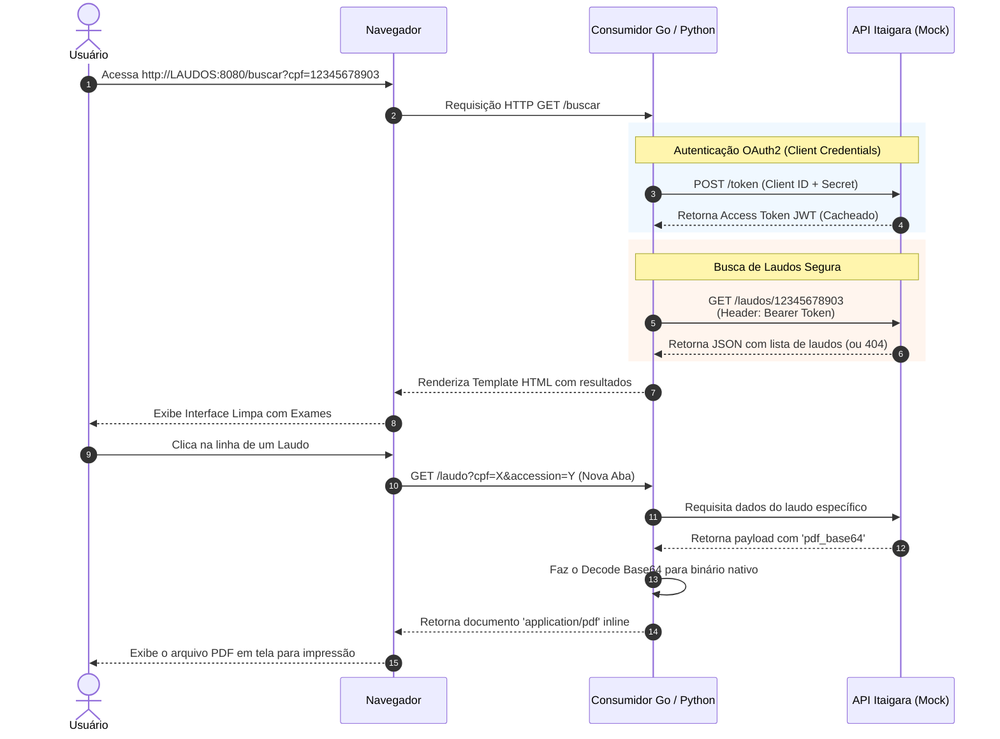

```text
  ___ _        _                         ____ _ _       _        
 |_ _| |_ __ _(_)__ _ __ _ _ _ __ _     / ___| (_)_ __ (_) ___   
  | ||  _/ _` | / _` / _` | '_/ _` |   | |   | | | '_ \| |/ __|  
 |___|\__\__,_|_\__, \__,_|_| \__,_|   | |___| | | | | | | (__   
                |___/                   \____|_|_|_| |_|_|\___|  
                                                                 
  ____                                   _     _                 
 / ___|___  _ __  ___ _   _ _ __ ___ (_) __| | ___  _ __       
| |   / _ \| '_ \/ __| | | | '_ ` _ \| |/ _` |/ _ \| '__|      
| |__| (_) | | | \__ \ |_| | | | | | | | (_| | (_) | |         
 \____\___/|_| |_|___/\__,_|_| |_| |_|_|\__,_|\___/|_|         

===================================================================
```

# Sistema Clínica Itaigara - Backend & Consumidores

Bem-vindo à documentação oficial do ecossistema de testes do Itaigara Clinic System. 

Este repositório é composto por **três aplicações independentes** criadas para simular o fluxo de distribuição confiável de laudos médicos em formato PDF. Este projeto atende às necessidades de testes para clientes internos e externos na modalidade Machine-To-Machine e interfaces TUI/Web.

---

## 🏗️ Visão Geral da Arquitetura & Fluxo (Mermaid diagram)

O diagrama abaixo ilustra todo o caminho percorrido desde o momento que o usuário acessa o link, até a autenticação invisível (M2M) e a devolução do PDF em tela:



### Componentes:
1. **API Mock (`/api-mock`)** (FastAPI): Simula o backend conectando com o BD e gerando tokens.
2. **Consumidor em Go (`/consumidor-go`)**: Interface de Terminal Rica (TUI) e Servidor Web veloz para consumo e renderização dos laudos.
3. **Consumidor em Python (`/consumidor-python`)**: Alternativa web demonstrando a mesma funcionalidade.

---

## 🔒 1. Passo a Passo: API Mock (Servidor Base)

O primeiro serviço a ser iniciado obrigatoriamente é a API Mock (porta `8000`), pois ela é o "core" que as outras aplicações irão consultar.

### Configuração:
1. Navegue até a pasta corporativa:
   ```bash
   cd /Users/raunick/Downloads/projetos/backenditaigara/api-mock
   ```
2. Crie e ative o ambiente virtual:
   ```bash
   python3 -m venv .venv
   source .venv/bin/activate
   ```
3. Instale as dependências:
   ```bash
   pip install -r requirements.txt
   ```

### Execução:
Você pode rodar no terminal conectado (para ver os logs em tempo real) ou em background (para que não ocupe uma aba do seu console).
*   **Tempo Real / Desenvolvimento:** `uvicorn main:app --port 8000 --reload`
*   **Plano de Fundo (Recomendado):** `nohup uvicorn main:app --port 8000 > api.log 2>&1 &`

---

## 🚀 2. Passo a Passo: Consumidor Go (Terminal + Web)

### Como compilar para Produção (Cliente Final):
Não envie o código fonte. Gere um arquivo binário único (plug-and-play):
```bash
# Para Mac (Apple Silicon)
go build -o consumidor-itaigara

# Para Windows (Estando no Mac)
GOOS=windows GOARCH=amd64 go build -o consumidor-itaigara.exe

# Para Linux
GOOS=linux GOARCH=amd64 go build -o consumidor-itaigara-linux
```
**Para entregar ao cliente, envie apenas 2 coisas:** O Binário gerado e a pasta `templates/`.

### Fluxo de Setup Interativo na primeira Execução:
Quando o cliente rodar o programa, se ele não enviar um arquivo `config.json` previamente preenchido, o terminal de fundo azul fará as perguntas iniciais:
- **Base URL:** `http://localhost:8000` (ou o IP de produção do Itaigara)
- **Client ID & Secret:** Chaves OAuth2.

Após salvar, o sistema exibirá uma TUI para buscas rápidas via terminal e inicializará o servidor Web na porta *8080*. O cliente poderá acessar navegando para [http://localhost:8080/buscar](http://localhost:8080/buscar).

---

## 🐍 3. Passo a Passo: Consumidor Python (Backend Alternativo)

Serviço concorrente (roda sob porta `8081`) e pode ser estendido facilmente pelo seu analista Python.

### Configuração e Execução:
1. Abra o respectivo diretório:
   ```bash
   cd /Users/raunick/Downloads/projetos/backenditaigara/consumidor-python
   ```
2. Inicialize o contêiner virtual e instale:
   ```bash
   python3 -m venv .venv
   source .venv/bin/activate
   pip install -r requirements.txt
   ```
3. Rode o servidor Web (Jinja2):
   ```bash
   uvicorn web:app --port 8081 --reload
   ```

---

## 🧪 Postman Collection (Testes Frios)
Na pasta `/api-mock/`, você tem o arquivo `Itaigara_API_Mock.postman_collection.json`. 

- Abra o Postman > Clique em **Import** (File > Import) e arraste o arquivo para dentro.
- Ele instalará a collection **Itaigara - Laudos API Mock** contendo as rotas exatas, passando por `POST /token` e enviando os Bearer Tokens automaticamente para buscar o laudo final, simulando a inteligência nativa dos consumidores criados.
